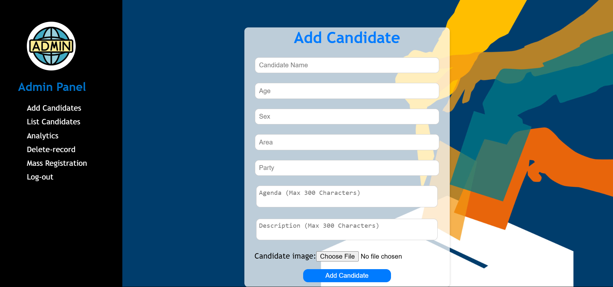
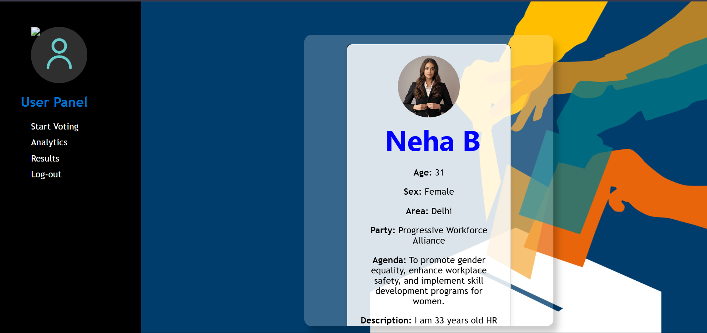
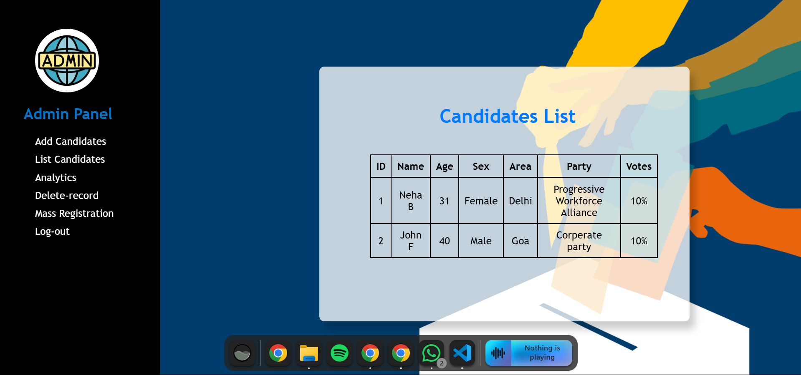
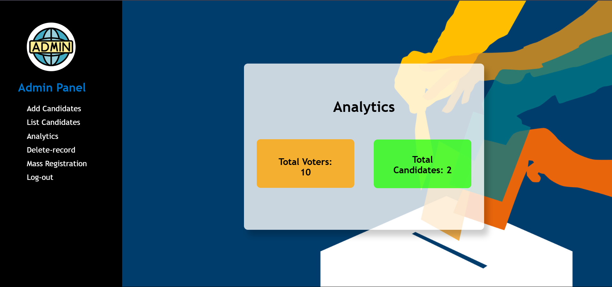

# 🗳️ Online Voting System with Homomorphic Encryption

An advanced and privacy-preserving **Online Voting System** developed using the **Paillier Cryptosystem**, a form of **Homomorphic Encryption**.  
This project simulates a real-world digital voting environment where **vote integrity, anonymity, and end-to-end security** are crucial.

Built with **Python (Flask)**, it allows voters to securely register, cast encrypted votes, and enables the admin to compute results **without decrypting individual votes** — a true use of privacy-first cryptography.

---

## 🔐 Key Features

- ✅ **Paillier Homomorphic Encryption**  
  Votes are encrypted before storage; only the final aggregated count is decrypted.

- 🔐 **End-to-End Security**  
  Complete data privacy throughout voting, counting, and result display.

- 👥 **Role-Based Access**  
  Separate login flows and dashboards for **Voters** and **Admins**.

- 💻 **Modern UI**  
  Clean and responsive interface built with **HTML**, **CSS**, and **Bootstrap**, served via **Flask**.

- 📊 **Live Result Panel**  
  Admin panel displays vote tallies securely in encrypted form, with a final decryption step.

- 🔏 **Authentication & Session Management**  
  Basic user verification and login sessions.

- 📁 **Screenshot Uploads**  
  Ability to store voting confirmation images or proofs.

- 🧩 **Lightweight Database**  
  Uses **SQLite** for easy local development and deployment.

---

## 🖥️ Tech Stack

| Layer      | Technologies                          |
|------------|----------------------------------------|
| Frontend   | HTML, CSS, Bootstrap                   |
| Backend    | Python (Flask)                         |
| Encryption | Paillier Cryptosystem (custom logic)   |
| Database   | SQLite (`voting.db`)                   |
| Libraries  | Flask, PyCryptodome, Cryptography      |

---

## 📸 Screenshots

### 🔐 Login Page

---

### 🧑‍💼 Admin Panel

---

### 🧑‍💼 User Panel

---

### 📈 Encrypted Vote Count View

---

### 🧾 Admin Analytics

---

### 🧾 Admin Mass Registration

---

